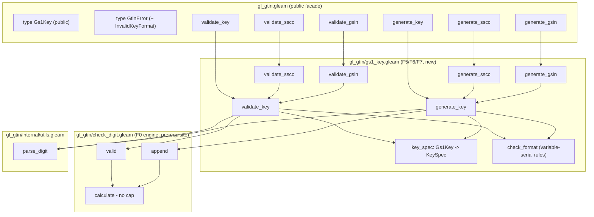

# Design Document

## Overview

This design implements the **Tier 2 GS1-key features F5–F7** from the `gl_gtin`
roadmap on top of the 3.0.0 codebase, using the **F0 generalized check-digit
engine** delivered by the sibling spec `.kiro/specs/gl-gtin-tier1-features/` as a
prerequisite. The additions are:

- **F5 — SSCC.** `validate_sscc` and `generate_sscc` for the 18-digit Serial
  Shipping Container Code. (Requirements 1, 2)
- **F6 — GSIN.** `validate_gsin` and `generate_gsin` for the 17-digit Global
  Shipment Identification Number. (Requirements 3, 4)
- **F7 — Generic GS1 keys.** A public `Gs1Key` enumeration plus `validate_key`
  and `generate_key`, key-parameterized over `Gtin`, `Gln`, `Sscc`, `Gsin`,
  `Grai`, `Giai`, `Gsrn`, `Gdti`, `Gcn`. (Requirements 5, 6, 7)

Every addition is **additive** to the public API and honors the library's design
principles: total functions (no `let assert`, `panic`, or `todo` in library
code), the `Result(value, GtinError)` public contract with specific error
variants, the opaque `Gtin` type left untouched, and a string-first API.
(Requirement 8)

All three features reuse the shared GS1 Modulo 10 engine. Because SSCC bodies are
17 digits and GSIN bodies are 16 digits, they depend on F0 having lifted the
`len > 13` cap and added the `valid`/`append` helpers. **F0 is a prerequisite
dependency, not in-scope work** for this design: it consumes
`check_digit.calculate`/`valid`/`append` as-is and does not redesign the engine.
(Requirement 9)

### Design principles applied

| Principle | How this design honors it |
|-----------|---------------------------|
| One check-digit engine | F5/F6/F7 route all check-digit work through F0 `check_digit.valid`/`append`/`calculate`; no second mod-10 implementation. (Req 9.2, 9.3) |
| `Result(_, GtinError)` at the boundary | Every new public function in `gl_gtin.gleam` returns `Result(_, GtinError)`; internal module errors map up via `result.map_error`. (Req 8.2) |
| Extend errors, don't panic | A single new variant `InvalidKeyFormat` is added to `GtinError` for key-specific structural failures. (Req 8.3) |
| Opaque `Gtin` | `Gtin` is untouched; new functions take/return `String` (validators return the string tag `"SSCC"`/`"GSIN"` or the `Gs1Key` value). (Req 8.5, 8.6) |
| Totality | No new `let assert`/`panic`/`todo`; all failure modes are `Error` variants. (Req 8.4) |
| Defect ordering | Every validator evaluates character validity → digit count → check digit → key-specific format, returning only the first failing rule. (Req 1.5, 3.5, 6.6) |

## Architecture

The existing three-layer structure is preserved: a thin public facade
(`gl_gtin.gleam`) delegates to internal modules and maps their module-local error
types up to the single public `GtinError`. New feature logic lives in a **new
module `gl_gtin/gs1_key.gleam`** that houses the `Gs1Key` type, the per-key
specification table, and the shared validate/generate machinery.

### Module placement decisions

- **F7** (`Gs1Key`, `validate_key`, `generate_key`, key-spec table) is the core
  of the new module `gl_gtin/gs1_key.gleam`. It is a cohesive concern — a
  key→length/format table plus a shared mod-10 validate/generate driver — that is
  distinct from GTIN-only validation and normalization.
- **F5 / F6** (`validate_sscc`, `generate_sscc`, `validate_gsin`, `generate_gsin`)
  are implemented as **thin specializations over the generic key machinery** in
  the same module. `validate_sscc` runs the generic validator for the `Sscc` key
  and, on success, returns the string tag `"SSCC"`; `generate_sscc` runs the
  generic generator for the `Sscc` key. This is chosen over standalone
  implementations because SSCC and GSIN are exactly fixed-length mod-10 keys with
  no structural component rules, so routing them through the generic driver
  removes duplicated length/character/check-digit logic and guarantees F5/F6 and
  the F7 `Sscc`/`Gsin` paths never diverge. (Req 9.2, 9.3)
- The `Gs1Key` **type is defined in `gl_gtin.gleam`** (the public facade) so it is
  part of the public API surface, and `gs1_key.gleam` imports it. All public
  entry points remain in `gl_gtin.gleam` as thin wrappers that map the internal
  error type to `GtinError`.



## Key Specification Table

Each `Gs1Key` variant maps to a `KeySpec` describing its **total length** (digits
including the check digit), its **body length** (digits supplied to a generator,
excluding the check digit = total − 1), and an optional **structural format rule**
for keys whose length alone is insufficient to validate.

The table is the single source of truth. It is structured so a length or boundary
can be corrected by editing one row without touching the validate/generate
algorithm. Every length/boundary the roadmap does not fully pin down is recorded
below with a status flag and a citation to the **GS1 General Specifications** (the
authoritative external reference; reference material, not a runtime service —
Requirement 10.6).

| `Gs1Key` | Total length | Body length | Structural rule | Status | Notes / open question (confirm vs GS1 General Specifications) |
|----------|-------------:|------------:|-----------------|--------|---------------------------------------------------------------|
| `Gtin`   | 8/12/13/14   | 7/11/12/13  | none (mod-10)   | confirmed | Delegates to existing GTIN validation lengths. Multi-length; the only variant whose spec is a length *set*. |
| `Gln`    | 13           | 12          | none (mod-10)   | confirmed | GLN is a 13-digit key (12-digit body + mod-10 check). Confirmed against the GS1 General Specifications. (Req 10.3) |
| `Sscc`   | 18           | 17          | none (mod-10)   | confirmed | AI (00). Extension digit + company prefix + serial reference + mod-10 check = 18 digits. Confirmed against the GS1 General Specifications. (Req 10.3) |
| `Gsin`   | 17           | 16          | none (mod-10)   | confirmed | AI (402). Company prefix + shipper reference + mod-10 check = 17 digits. Confirmed against the GS1 General Specifications. (Req 10.3) |
| `Gsrn`   | 18           | 17          | none (mod-10)   | confirmed | AI (8018). 18-digit numeric key (17-digit body + mod-10 check). Confirmed against the GS1 General Specifications. (Req 10.3) |
| `Grai`   | 13 + serial  | 12 + serial | 13-digit numeric base (GS1 company prefix + asset type + mod-10 check on position 13) + optional serial up to 16 alphanumeric chars | open question | **Design assumption (revised):** GRAI (AI 8003) = a 13-digit numeric base carrying its own mod-10 check on the 13th digit, followed by an optional variable serial of up to 16 alphanumeric characters; total length alone is insufficient. Base length (13) and serial max (16 alphanumeric) confirmed against the GS1 General Specifications; the check applies to the 13-digit base only. Exact serial charset constraints (GS1 AI-charset subset) pending confirmation. (Req 10.4) |
| `Giai`   | variable     | variable    | GS1 company prefix (numeric) + variable individual asset reference; no key-level check digit | open question | **Design assumption:** GIAI (AI 8004) = numeric GS1 company prefix followed by a variable-length individual asset reference, total up to 30 characters; no single fixed total length and no key-level check digit. Overall max length (30) confirmed against the GS1 General Specifications; exact company-prefix/reference boundary pending confirmation. (Req 10.4) |
| `Gdti`   | 13 + serial  | 12 + serial | 13-digit base component (check applies to base only) + optional variable serial up to 17 digits | open question | **Design assumption:** GDTI (AI 253) = 13-digit document-type base plus optional variable serial of up to 17 digits; the check digit applies to the 13-digit base only. Base length (13) and serial max (17) confirmed against the GS1 General Specifications; serial charset (numeric) pending final confirmation. (Req 10.5) |
| `Gcn`    | 13 + serial  | 12 + serial | 13-digit base component (check applies to base only) + optional variable serial up to 12 digits | open question | **Design assumption:** GCN (AI 255) = 13-digit base plus optional variable serial of up to 12 digits; the check digit applies to the 13-digit base only. Base length (13) and serial max (12) confirmed against the GS1 General Specifications. (Req 10.5) |

Assumptions section satisfying Requirement 10:

- **One labeled entry per variant, none omitted** (nine rows above), each carrying
  exactly one status flag of "confirmed" or "open question". (Req 10.1, 10.2)
- Length assumptions for `Sscc` (18), `Gsrn` (18), `Gsin` (17), `Gln` (13) are now
  **confirmed** against the GS1 General Specifications (each a single-length mod-10
  key). (Req 10.3)
- `Grai` and `Giai` carry the variable-serial entry noting total length alone is
  insufficient. GRAI's 13-digit base and 16-char serial max, and GIAI's 30-char
  overall max, are confirmed; each remains flagged "open question" for the exact
  component boundaries / serial charset pending the GS1 General Specifications.
  (Req 10.4)
- `Gdti` and `Gcn` carry the 13-digit-base-plus-optional-serial entry with the
  check digit applying to the 13-digit base only (confirmed), and serial maxima of
  17 (GDTI) and 12 (GCN) digits confirmed; GDTI's serial charset remains flagged
  "open question" pending the GS1 General Specifications. (Req 10.5)
- The GS1 General Specifications is named as the authoritative external reference
  for every assumption and noted as reference material, not a runtime service.
  (Req 10.6)

### `KeySpec` representation

To keep single-length keys, the multi-length `Gtin`, and variable-serial keys in
one table without special-casing the algorithm, `KeySpec` carries a length rule
and an optional format-rule tag:

```gleam
// Length rule for a key. FixedLen for single-length keys; OneOf for GTIN;
// BasePlusSerial for base+optional-variable-serial keys; Variable for GIAI.
pub type LengthRule {
  FixedLen(total: Int)
  OneOf(totals: List(Int))
  BasePlusSerial(base_total: Int, serial_min: Int, serial_max: Int)
  VariableLen(min_total: Int, max_total: Int)
}

// Optional key-specific structural format rule, evaluated only after
// character/length/check-digit rules pass.
pub type FormatRule {
  NoFormatRule
  GraiRule
  GiaiRule
}

pub type KeySpec {
  KeySpec(length: LengthRule, format: FormatRule)
}
```

The key-spec table (Requirement 5.2) is a single total function
`key_spec(key: Gs1Key) -> KeySpec` — one exhaustive `case`, one row per variant.
Correcting a length or boundary is a one-line edit to that function; the
validate/generate driver reads `KeySpec` generically and never hard-codes a
length. (Req 5.2)

## Components and Interfaces

Signatures use exact Gleam syntax. "New" marks additions.

### Public facade — `gl_gtin.gleam`

```gleam
// New public type enumerating the supported GS1 keys. (Req 5.1)
pub type Gs1Key {
  Gtin
  Gln
  Sscc
  Gsin
  Grai
  Giai
  Gsrn
  Gdti
  Gcn
}

// F5 — SSCC. Returns Ok("SSCC") on success. (Req 1, 2)
pub fn validate_sscc(code: String) -> Result(String, GtinError)
pub fn generate_sscc(body: String) -> Result(String, GtinError)

// F6 — GSIN. Returns Ok("GSIN") on success. (Req 3, 4)
pub fn validate_gsin(code: String) -> Result(String, GtinError)
pub fn generate_gsin(body: String) -> Result(String, GtinError)

// F7 — generic keys. (Req 6, 7)
pub fn validate_key(key: Gs1Key, code: String) -> Result(Gs1Key, GtinError)
pub fn generate_key(key: Gs1Key, body: String) -> Result(String, GtinError)
```

Each wrapper delegates to `gs1_key.*` and maps the internal error to `GtinError`
via `result.map_error`, exactly as the existing `validate`/`normalize` wrappers
do. All existing public functions and types are unchanged. (Req 8.1)

> **Note — `Gtin` name collision.** `Gs1Key` introduces a variant named `Gtin`,
> while the module already has an opaque type `Gtin`. In Gleam a type and a value
> constructor live in separate namespaces, so this compiles, but to avoid reader
> confusion the design keeps the opaque type as `Gtin` and the `Gs1Key` variant as
> `Gtin`; references in function signatures disambiguate by position (type vs
> constructor). If the maintainer prefers, the opaque type may remain and the
> enum variant is still legal — no rename is required by the requirements. This is
> flagged for the implementer to confirm during task execution.

### Internal module — `gl_gtin/gs1_key.gleam` (new)

```gleam
import gl_gtin.{type Gs1Key}
// (Gs1Key variants imported unqualified for the case tables.)

// Internal error type, mapped to GtinError at the facade.
pub type KeyError {
  InvalidLength(got: Int)
  InvalidCheckDigit
  InvalidCharacters
  InvalidKeyFormat
}

// The per-key specification (Req 5.2). One exhaustive case, one row per variant.
pub fn key_spec(key: Gs1Key) -> KeySpec

// Generic validator (Req 6). Ordering: character validity -> digit count ->
// check digit -> key-specific structural format; first failing rule only.
pub fn validate_key(key: Gs1Key, code: String) -> Result(Gs1Key, KeyError)

// Generic generator (Req 7). Ordering: character validity -> body length ->
// key-specific format; appends the engine check digit.
pub fn generate_key(key: Gs1Key, body: String) -> Result(String, KeyError)

// F5/F6 specializations over the generic machinery.
pub fn validate_sscc(code: String) -> Result(String, KeyError) // Ok("SSCC")
pub fn generate_sscc(body: String) -> Result(String, KeyError)
pub fn validate_gsin(code: String) -> Result(String, KeyError) // Ok("GSIN")
pub fn generate_gsin(body: String) -> Result(String, KeyError)

// --- private helpers ---

// Trim, then parse every character to a digit; Error(InvalidCharacters) on any
// non-digit (interior whitespace included). Reuses utils.parse_digit.
fn parse_body_digits(code: String) -> Result(List(Int), KeyError)

// Check a trimmed digit count against a LengthRule; Error(InvalidLength(got: n)).
fn check_length(rule: LengthRule, count: Int) -> Result(Nil, KeyError)

// Apply a FormatRule to the already-length-and-check-valid digit list.
// NoFormatRule -> Ok(Nil); GraiRule/GiaiRule -> structural checks, else
// Error(InvalidKeyFormat). Evaluated last in the ordering. (Req 6.7, 7.4)
fn check_format(rule: FormatRule, digits: List(Int)) -> Result(Nil, KeyError)
```

Design notes:

- **`validate_key`** flow (Req 6.1, 6.3–6.6):
  1. `string.trim` the code.
  2. `parse_body_digits` — any non-digit (incl. interior whitespace) →
     `InvalidCharacters`. Empty/whitespace-only trims to length 0 and continues to
     the length check, which yields `InvalidLength(got: 0)`. (Req 6.3, and the
     empty cases in 1.6/3.6 for the SSCC/GSIN specializations)
  3. `check_length(spec.length, count)` — mismatch → `InvalidLength(got: n)` with
     `n` = trimmed digit count. (Req 6.4)
  4. Check digit via **F0 `check_digit.valid(digits)`** — `False` →
     `InvalidCheckDigit`. (Req 6.5, 9.3)
  5. `check_format(spec.format, digits)` — variable-serial structural failure →
     `InvalidKeyFormat`. (Req 6.7)
  6. On all passing, `Ok(key)` — the supplied `Gs1Key` value. (Req 6.1)
  Because each call validates only against the `Gs1Key` passed in, two identical-
  length codes valid for different kinds are each judged solely against their
  supplied kind. (Req 6.8)

- **`generate_key`** flow (Req 7.1–7.4):
  1. `string.trim` the body.
  2. `parse_body_digits` — non-digit → `InvalidCharacters`, **evaluated before**
     the body-length check. (Req 7.2)
  3. `check_length` against the **body** length (`total − 1` for fixed keys, or the
     `BasePlusSerial`/`VariableLen` body derivation) — mismatch →
     `InvalidLength(got: n)`. (Req 7.3)
  4. `check_format` for variable-serial keys → `InvalidKeyFormat` on structural
     failure. (Req 7.4)
  5. Append the check digit via **F0 `check_digit.append`** and render the string.
     (Req 7.1, 9.3)

- **`validate_sscc`** = `validate_key(Sscc, code)` then map `Ok(Sscc) -> Ok("SSCC")`.
  A GTIN-14 (14 digits) fails `check_length` for the 18-digit `Sscc` spec →
  `InvalidLength(got: 14)`, never `Ok("SSCC")`. (Req 1.1–1.7)
- **`validate_gsin`** = `validate_key(Gsin, code)` then map `Ok(Gsin) -> Ok("GSIN")`.
  An 18-digit SSCC fails the 17-digit `Gsin` length check →
  `InvalidLength(got: 18)`, never `Ok("GSIN")`. (Req 3.1–3.7)
- **`generate_sscc`** = `generate_key(Sscc, body)`; **`generate_gsin`** =
  `generate_key(Gsin, body)`. (Req 2, 4)

## Data Models

### `Gs1Key` (new public type)

Defined in `gl_gtin.gleam`, with exactly nine variants `Gtin`, `Gln`, `Sscc`,
`Gsin`, `Grai`, `Giai`, `Gsrn`, `Gdti`, `Gcn`. Each variant is associated with its
length and format rules through `gs1_key.key_spec`, so two keys sharing a digit
length (e.g. `Sscc` and `Gsrn`, both 18) are distinguished by their `Gs1Key` value
rather than by length alone. (Req 5.1, 5.2)

### `KeySpec` / `LengthRule` / `FormatRule` (new, internal to `gs1_key.gleam`)

As defined in the Key Specification Table section. These are internal
representations; they are not part of the public API and can evolve freely.

### `GtinError` extension (public)

A single new variant is added to the public `GtinError`:

```gleam
pub type GtinError {
  InvalidLength(got: Int)
  InvalidCheckDigit
  InvalidCharacters
  NoGs1PrefixFound
  InvalidFormat
  InvalidKeyFormat   // New: key-specific structural failure (Req 8.3, 6.7, 7.4)
}
```

`InvalidKeyFormat` denotes a variable-serial key (`Grai`/`Giai`) whose length and
check digit are plausible but whose component structure is malformed. It is used
only where no existing variant fits (`InvalidFormat` remains reserved for the
existing GTIN format-conversion failures to avoid overloading its meaning).

> **Compatibility note.** Adding an enum variant is an **additive** change, so the
> release remains a **minor** bump per the roadmap. However, downstream callers
> that exhaustively `case` over `GtinError` will need to add an
> `InvalidKeyFormat` arm to keep compiling. This is documented in `CHANGELOG.md`
> and called out here so the implementer notes it in the release entry. (Req 8.3)

## Error Handling

### Internal `KeyError` → public `GtinError` mapping (facade wrappers)

| Internal `KeyError` | Public `GtinError` |
|---------------------|--------------------|
| `InvalidLength(got)` | `InvalidLength(got)` |
| `InvalidCheckDigit` | `InvalidCheckDigit` |
| `InvalidCharacters` | `InvalidCharacters` |
| `InvalidKeyFormat` | `InvalidKeyFormat` |

The F0 `check_digit` engine's `CheckDigitError` never surfaces directly from the
key functions: `validate_key` uses `check_digit.valid` (returns `Bool`), and
`generate_key` maps any `check_digit.append` error into `KeyError` before the
facade boundary. (Req 8.2, 9.3)

### Defect ordering per function (first matching error returned)

| Function | Ordering |
|----------|----------|
| `validate_sscc` | characters → digit count (=18) → check digit (Req 1.5) |
| `validate_gsin` | characters → digit count (=17) → check digit (Req 3.5) |
| `validate_key` | characters → digit count → check digit → key-specific format (Req 6.6) |
| `generate_sscc` / `generate_gsin` | characters → body length (Req 2.2/2.3, 4.2/4.3) |
| `generate_key` | characters → body length → key-specific format (Req 7.2–7.4) |

Character validity is checked before length in every function, matching the
existing `validation.validate` flow (trim → parse digits → length → check digit).
The empty/whitespace-only case trims to zero digits and, since parsing an empty
list produces no character error, falls through to the length rule yielding
`InvalidLength(got: 0)`. (Req 1.6, 3.6)

Every function is total: all failure modes return an `Error` variant; none use
`let assert`, `panic`, or `todo`. (Req 8.4)

## Correctness Properties

*A property is a characteristic or behavior that should hold true across all valid
executions of a system — essentially, a formal statement about what the system
should do. Properties serve as the bridge between human-readable specifications
and machine-verifiable correctness guarantees.*

### Prework summary

The requirements' round-trip acceptance criteria (2.4, 4.4, 7.5) and the
same-length-no-collision criterion (6.8) are universal statements over large input
spaces (all 17-digit bodies, all 16-digit bodies, all bodies valid per kind),
making them PROPERTY-classified. The type-shape criteria (5.1, 5.2) are structural
(EXAMPLE). The specific rejection criteria (1.7, 3.7) are universal over their
respective valid code spaces and are captured as properties below. The
variable-serial format criteria (6.7, 7.4) are EDGE_CASE/EXAMPLE and are covered
in unit tests rather than as standalone properties, since their exact boundaries
are open questions.

### Property 1: SSCC generate → validate round-trip (F5)

*For any* 17-digit numeric body, `generate_sscc(body)` returns `Ok(sscc)` and
`validate_sscc(sscc)` returns `Ok("SSCC")`.

**Validates: Requirements 2.4, 2.1, 1.1**

### Property 2: GSIN generate → validate round-trip (F6)

*For any* 16-digit numeric body, `generate_gsin(body)` returns `Ok(gsin)` and
`validate_gsin(gsin)` returns `Ok("GSIN")`.

**Validates: Requirements 4.4, 4.1, 3.1**

### Property 3: Generic key generate → validate round-trip (F7)

*For any* `Gs1Key` kind and *any* body valid for that kind, when
`generate_key(kind, body)` returns `Ok(key_string)` then
`validate_key(kind, key_string)` returns `Ok(kind)`.

**Validates: Requirements 7.5, 7.1, 6.1**

### Property 4: Same-length keys are judged only against the supplied kind (F7)

*For any* two `Gs1Key` kinds that share a total digit length (e.g. `Sscc` and
`Gsrn` at 18), and *any* code of that length, `validate_key(k, code)` depends only
on `k`'s spec — a code valid for one kind is accepted under that kind and evaluated
against the other kind strictly by that other kind's rules.

**Validates: Requirements 6.8, 5.2**

### Property 5: SSCC validation rejects a valid GTIN-14 by length (F5)

*For any* valid 14-digit GTIN-14 code, `validate_sscc` returns
`Error(InvalidLength(got: 14))` and never `Ok("SSCC")`.

**Validates: Requirements 1.7**

### Property 6: GSIN validation rejects a valid SSCC by length (F6)

*For any* valid 18-digit SSCC code, `validate_gsin` returns
`Error(InvalidLength(got: 18))` and never `Ok("GSIN")`.

**Validates: Requirements 3.7**

### Property 7: Wrong length is reported with the trimmed digit count (F5/F6/F7)

*For any* numeric string whose trimmed digit count `n` does not satisfy the
selected key's required length, the corresponding validator returns
`Error(InvalidLength(got: n))`.

**Validates: Requirements 1.3, 3.3, 6.4**

### Property 8: Non-digit input is rejected before length (F5/F6/F7)

*For any* string containing a character outside `0`–`9` (interior whitespace
included), every validator and generator returns `Error(InvalidCharacters)`
regardless of the string's length.

**Validates: Requirements 1.2, 2.3, 3.2, 4.3, 6.3, 7.2**

## Testing Strategy

### Dual approach

- **Property-based tests** verify the universal invariants above across many
  generated inputs. F5/F6/F7 are pure, string-first mod-10 transformations over a
  large input space, so PBT is appropriate.
- **Unit (example) tests** pin the worked examples, the defect-ordering cases, the
  empty/whitespace cases, the variable-serial `InvalidKeyFormat` cases, and the
  doc-comment examples.

### Property-based testing library

Use **`qcheck`** (the maintained Gleam property-testing library) with gleeunit as
the runner. Each property test runs a **minimum of 100 iterations**. If `qcheck`
cannot be added, fall back to deterministic in-repo generators (seeded loops over
sampled digit strings) run for ≥100 cases — the properties are identical either
way. Do not implement PBT from scratch beyond generator helpers.

Generators needed:

- `gen_sscc_body()` — random 17-digit numeric string (F5).
- `gen_gsin_body()` — random 16-digit numeric string (F6).
- `gen_key_body(kind)` — random body of the correct body length for `kind`,
  respecting `BasePlusSerial`/`VariableLen` for the variable-serial kinds using the
  assumed boundaries in the Key Specification Table (F7).

### Property test mapping

| Property | Test | Generator |
|----------|------|-----------|
| P1 SSCC round-trip | `validate_sscc(generate_sscc(b)) == Ok("SSCC")` | `gen_sscc_body` |
| P2 GSIN round-trip | `validate_gsin(generate_gsin(b)) == Ok("GSIN")` | `gen_gsin_body` |
| P3 key round-trip | `validate_key(k, generate_key(k, b)) == Ok(k)` | `gen_key_body(k)` over all kinds |
| P4 no same-length collision | pair `Sscc`/`Gsrn` codes; each validated only under its kind | `gen_key_body` |
| P5 SSCC rejects GTIN-14 | `validate_sscc(gtin14) == Error(InvalidLength(got: 14))` | valid GTIN-14 codes |
| P6 GSIN rejects SSCC | `validate_gsin(sscc) == Error(InvalidLength(got: 18))` | `gen_sscc_body` + append check |
| P7 wrong length count | `validate_*(n-digit) == Error(InvalidLength(got: n))` | random-length numeric strings |
| P8 non-digit rejected | inject a non-digit → `Error(InvalidCharacters)` | any body + random bad char |

Each property test is tagged with a comment:
`// Feature: gl-gtin-gs1-keys, Property {number}: {property_text}`.

### Unit / example tests (per feature, success + failure — Requirement 8.7)

- **F5 (SSCC):** a valid 18-digit SSCC → `Ok("SSCC")`; wrong check digit →
  `Error(InvalidCheckDigit)`; 17/19-digit numeric → `Error(InvalidLength(got: n))`;
  interior space → `Error(InvalidCharacters)`; empty/whitespace →
  `Error(InvalidLength(got: 0))`; a valid GTIN-14 → `Error(InvalidLength(got: 14))`;
  `generate_sscc` of a 17-digit body → 18-digit result; 16-digit body →
  `Error(InvalidLength(got: 16))`.
- **F6 (GSIN):** mirror of F5 at lengths 17/16, including a valid SSCC →
  `Error(InvalidLength(got: 18))`.
- **F7 (generic):** **`validate_key(Gln, "0614141000012") == Ok(Gln)`** (worked
  example — check digit `2` confirmed correct: body `061414100001` → mod-10 sum 48
  → check `2`); `validate_key(Gln, "0614141000013") == Error(InvalidCheckDigit)`;
  a same-length pair (`Sscc` vs `Gsrn`) each validated under its own kind;
  non-digit → `Error(InvalidCharacters)`; wrong length →
  `Error(InvalidLength(got: n))`; a `Grai`/`Giai` body that meets length but
  violates the assumed structural rule → `Error(InvalidKeyFormat)` (marked pending
  GS1 confirmation); `generate_key(Sscc, body)` equals `generate_sscc(body)`.

### Doc-comment example tests (Requirement 8.8)

Every new public function's doc-comment example (`validate_sscc`, `generate_sscc`,
`validate_gsin`, `generate_gsin`, `validate_key`, `generate_key`) is mirrored by an
assertion in the suite so the stated outputs are verified with zero failures. The
SSCC/GSIN doc examples must use bodies whose check digits are computed against the
engine so the example output strings are exact.

### Release-discipline checks (Requirement 8.9, 8.10)

- A single `CHANGELOG.md` entry names each of the F5, F6, and F7 additions and
  notes the new `InvalidKeyFormat` `GtinError` variant.
- `gleam format --check` must exit zero with no files needing reformatting; CI
  (`.github/workflows/test.yml`) runs `gleam test` and the format check.

## Requirements Traceability Summary

| Requirement | Design element |
|-------------|----------------|
| 1 (validate SSCC) | `validate_sscc` = `validate_key(Sscc, _)`→`"SSCC"`; ordering char→len→check; GTIN-14 rejected by length; Properties 1, 5, 7, 8 |
| 2 (generate SSCC) | `generate_sscc` = `generate_key(Sscc, _)` via `check_digit.append`; Property 1 |
| 3 (validate GSIN) | `validate_gsin` = `validate_key(Gsin, _)`→`"GSIN"`; SSCC rejected by length; Properties 2, 6, 7, 8 |
| 4 (generate GSIN) | `generate_gsin` = `generate_key(Gsin, _)`; Property 2 |
| 5 (Gs1Key type) | public `Gs1Key` (9 variants) in facade; `key_spec` table associates length/format; Properties 3, 4 |
| 6 (validate_key) | generic validator, defect ordering char→len→check→format, `Ok(key)`, `InvalidKeyFormat` for Grai/Giai; worked example `Gln`; Properties 3, 4, 7, 8 |
| 7 (generate_key) | generic generator, char-before-length, `InvalidKeyFormat`, append check digit; Property 3, 8 |
| 8 (quality) | additive facade wrappers, `Result(_, GtinError)`, new `InvalidKeyFormat` variant, totality, opaque `Gtin` untouched, string-first, per-feature + doc-example tests, CHANGELOG, format check |
| 9 (F0 prerequisite) | consumes `check_digit.calculate`/`valid`/`append`; no second mod-10 impl; prefers `valid`/`append`; F0 out of scope |
| 10 (assumptions) | Key Specification Table: one flagged entry per variant, SSCC/GSRN/GSIN/GLN lengths open, Grai/Giai variable-serial, Gdti/Gcn base+serial, GS1 General Specifications cited as reference material |
```