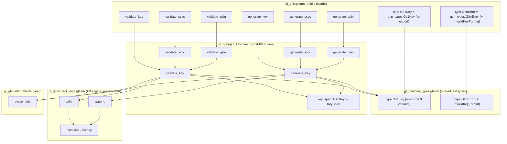

# Design Document

## Overview

This design implements the **Tier 2 GS1-key features F5–F7** from the `gl_gtin`
roadmap on top of the 3.0.0 codebase, using the **F0 generalized check-digit
engine** delivered by the sibling spec `.kiro/specs/gl-gtin-tier1-features/` as a
prerequisite. The additions are:

- **F5 — SSCC.** `validate_sscc` and `generate_sscc` for the 18-digit Serial
  Shipping Container Code. (Requirements 1, 2)
- **F6 — GSIN.** `validate_gsin` and `generate_gsin` for the 17-digit Global
  Shipment Identification Number. (Requirements 3, 4)
- **F7 — Generic GS1 keys.** A public `Gs1Key` enumeration plus `validate_key`
  and `generate_key`, key-parameterized over `Gtin`, `Gln`, `Sscc`, `Gsin`,
  `Grai`, `Giai`, `Gsrn`, `Gdti`, `Gcn`. (Requirements 5, 6, 7)

Every addition is **additive** to the public API and honors the library's design
principles: total functions (no `let assert`, `panic`, or `todo` in library
code), the `Result(value, GtinError)` public contract with specific error
variants, the opaque `Gtin` type left untouched, and a string-first API.
(Requirement 8)

All three features reuse the shared GS1 Modulo 10 engine. Because SSCC bodies are
17 digits and GSIN bodies are 16 digits, they depend on F0 having lifted the
`len > 13` cap and added the `valid`/`append` helpers. **F0 is a prerequisite
dependency, not in-scope work** for this design: it consumes
`check_digit.calculate`/`valid`/`append` as-is and does not redesign the engine.
(Requirement 9)

### Design principles applied

| Principle | How this design honors it |
|-----------|---------------------------|
| One check-digit engine | F5/F6/F7 route all check-digit work through F0 `check_digit.valid`/`append`/`calculate`; no second mod-10 implementation. (Req 9.2, 9.3) |
| `Result(_, GtinError)` at the boundary | Every new public function in `gl_gtin.gleam` returns `Result(_, GtinError)`; internal module errors map up via `result.map_error`. (Req 8.2) |
| Extend errors, don't panic | A single new variant `InvalidKeyFormat` is added to `GtinError` for key-specific structural failures. (Req 8.3) |
| Opaque `Gtin` | `Gtin` is untouched; new functions take/return `String` (validators return the string tag `"SSCC"`/`"GSIN"` or the `Gs1Key` value). (Req 8.5, 8.6) |
| Totality | No new `let assert`/`panic`/`todo`; all failure modes are `Error` variants. (Req 8.4) |
| Defect ordering | Every validator evaluates character validity → digit count → check digit → key-specific format, returning only the first failing rule. (Req 1.5, 3.5, 6.6) |

## Architecture

The existing three-layer structure is preserved: a thin public facade
(`gl_gtin.gleam`) delegates to internal modules and maps their module-local error
types up to the single public `GtinError`. New feature logic lives in a **new
module `gl_gtin/gs1_key.gleam`** that houses the `Gs1Key` type, the per-key
specification table, and the shared validate/generate machinery.

### Module placement decisions

- **F7** (`Gs1Key`, `validate_key`, `generate_key`, key-spec table) is the core
  of the new module `gl_gtin/gs1_key.gleam`. It is a cohesive concern — a
  key→length/format table plus a shared mod-10 validate/generate driver — that is
  distinct from GTIN-only validation and normalization.
- **F5 / F6** (`validate_sscc`, `generate_sscc`, `validate_gsin`, `generate_gsin`)
  are implemented as **thin specializations over the generic key machinery** in
  the same module. `validate_sscc` runs the generic validator for the `Sscc` key
  and, on success, returns the string tag `"SSCC"`; `generate_sscc` runs the
  generic generator for the `Sscc` key. This is chosen over standalone
  implementations because SSCC and GSIN are exactly fixed-length mod-10 keys with
  no structural component rules, so routing them through the generic driver
  removes duplicated length/character/check-digit logic and guarantees F5/F6 and
  the F7 `Sscc`/`Gsin` paths never diverge. (Req 9.2, 9.3)
- The `Gs1Key` **type is defined in `gl_gtin/gtin_types.gleam`** and
  **re-exported from the `gl_gtin` facade** via `pub type Gs1Key =
  gtin_types.Gs1Key`, so the public name `gl_gtin.Gs1Key` is unchanged. All
  public entry points remain in `gl_gtin.gleam` as thin wrappers that map the
  internal error type to `GtinError`.

  > **Implementation note (revised during task execution).** The type was
  > originally slated to live in the facade. That created an import cycle
  > `gl_gtin → gs1_key → gl_gtin`: the facade delegates its F5/F6/F7 wrappers to
  > `gl_gtin/gs1_key`, which needs the `Gs1Key` type and its variants, but
  > `gs1_key` cannot import the facade without a cycle. Gleam also cannot
  > re-export value constructors through a type alias, so a facade-defined type
  > could not expose its variants to `gs1_key` cleanly. The resolution: the
  > `Gs1Key` type **and its nine variants** live in the shared leaf module
  > `gl_gtin/gtin_types.gleam` — which already owns `GtinError`/`GtinFormat` — and
  > is imported by both the facade and `gs1_key` without a cycle. Consumers import
  > the variants from `gl_gtin/gtin_types` (e.g. `import gl_gtin/gtin_types.{Sscc,
  > Gsin}`), mirroring the existing `GtinError`/`GtinFormat` convention.



## Key Specification Table

Each `Gs1Key` variant maps to a `KeySpec` describing its **total length** (for
numeric keys, digits including the check digit), its **body length** (characters
supplied to a generator), and, for base-plus-serial keys, the serial's maximum
length and charset. The `KeySpec` shape itself selects the validate/generate
behavior, so no separate structural-format rule tag is needed.

The table is the single source of truth. It is structured so a length or boundary
can be corrected by editing one row without touching the validate/generate
algorithm. Every length/boundary is confirmed against the **GS1 General
Specifications** (the authoritative external reference; reference material, not a
runtime service — Requirement 10.6) and carries a status flag.

| `Gs1Key` | Total length | Body length | Structural rule | Status | Notes (confirmed vs GS1 General Specifications) |
|----------|-------------:|------------:|-----------------|--------|---------------------------------------------------------------|
| `Gtin`   | 8/12/13/14   | 7/11/12/13  | none (mod-10)   | confirmed | Delegates to existing GTIN validation lengths. Multi-length; the only variant whose spec is a length *set*. |
| `Gln`    | 13           | 12          | none (mod-10)   | confirmed | GLN is a 13-digit key (12-digit body + mod-10 check). Confirmed against the GS1 General Specifications. (Req 10.3) |
| `Sscc`   | 18           | 17          | none (mod-10)   | confirmed | AI (00). Extension digit + company prefix + serial reference + mod-10 check = 18 digits. Confirmed against the GS1 General Specifications. (Req 10.3) |
| `Gsin`   | 17           | 16          | none (mod-10)   | confirmed | AI (402). Company prefix + shipper reference + mod-10 check = 17 digits. Confirmed against the GS1 General Specifications. (Req 10.3) |
| `Gsrn`   | 18           | 17          | none (mod-10)   | confirmed | AI (8018). 18-digit numeric key (17-digit body + mod-10 check). Confirmed against the GS1 General Specifications. (Req 10.3) |
| `Grai`   | 13 + serial  | 12 + serial | 13-digit numeric base (mod-10 check on the 13th digit) + optional serial up to 16 ALPHANUMERIC (CSET 82) chars | confirmed | **Confirmed (task 1.1):** GRAI (AI 8003) = a 13-digit numeric base carrying its own mod-10 check on the 13th digit, followed by an optional variable serial of 0..16 alphanumeric characters; total length alone is insufficient. Base 13, serial ≤ 16 alphanumeric, mod-10 on the base — all confirmed against the GS1 General Specifications. The exact CSET 82 punctuation subset is treated as a charset-membership predicate (digits + letters) and does not affect any length/boundary. (Req 10.4) |
| `Giai`   | 1..30        | 1..30       | 1..30 alphanumeric characters; no key-level check digit | confirmed | **Confirmed (task 1.1):** GIAI (AI 8004) = 1..30 ALPHANUMERIC characters total, with NO key-level check digit and no fixed internal boundary the library can assert positionally. Overall length 1..30 alphanumeric confirmed against the GS1 General Specifications. The exact CSET 82 punctuation subset is treated as a charset-membership predicate (digits + letters). (Req 10.4) |
| `Gdti`   | 13 + serial  | 12 + serial | 13-digit numeric base (mod-10 check on the 13th digit) + optional serial up to 17 ALPHANUMERIC chars | confirmed | **Confirmed (task 1.1):** GDTI (AI 253) = 13-digit document-type base plus optional variable serial of 0..17 ALPHANUMERIC characters; the check digit applies to the 13-digit base only. Base 13 and serial ≤ 17 confirmed against the GS1 General Specifications; the serial **charset was corrected from numeric to alphanumeric in task 1.1**. The exact CSET 82 punctuation subset is treated as a charset-membership predicate (digits + letters). (Req 10.5) |
| `Gcn`    | 13 + serial  | 12 + serial | 13-digit numeric base (mod-10 check on the 13th digit) + optional serial up to 12 NUMERIC digits | confirmed | **Confirmed (task 1.1):** GCN (AI 255) = 13-digit base plus optional variable serial of 0..12 NUMERIC digits; the check digit applies to the 13-digit base only. Base 13 and serial ≤ 12 numeric confirmed against the GS1 General Specifications. Because the serial is numeric, GCN's union charset is digits-only. (Req 10.5) |

Assumptions section satisfying Requirement 10:

- **One labeled entry per variant, none omitted** (nine rows above), each carrying
  exactly one status flag — all nine are now "confirmed". (Req 10.1, 10.2)
- Length assumptions for `Sscc` (18), `Gsrn` (18), `Gsin` (17), `Gln` (13) are
  **confirmed** against the GS1 General Specifications (each a single-length mod-10
  key). (Req 10.3)
- `Grai` and `Giai` are **confirmed** (task 1.1): GRAI is a 13-digit numeric base
  (mod-10 on the base) plus an optional serial ≤ 16 alphanumeric characters; GIAI
  is 1..30 alphanumeric characters with no key-level check digit. (Req 10.4)
- `Gdti` and `Gcn` are **confirmed** (task 1.1): each is a 13-digit numeric base
  with the mod-10 check applying to the base only, plus an optional serial — GDTI
  ≤ 17 **alphanumeric** characters (charset corrected from numeric to alphanumeric
  in task 1.1) and GCN ≤ 12 **numeric** digits. (Req 10.5)
- The GS1 General Specifications is named as the authoritative external reference
  for every assumption and noted as reference material, not a runtime service.
  (Req 10.6)
- The one remaining nuance is not a boundary: the exact CSET 82 punctuation subset
  for alphanumeric serials is treated as a charset-membership predicate (digits +
  letters) and does not affect any length or boundary in the table above.

### `KeySpec` representation

The shipped driver folds the length rule and the structural behavior into a single
`KeySpec` whose **shape** selects the algorithm — there is no separate format-rule
tag. Three shapes cover all nine kinds:

```gleam
// The character set permitted in a base-plus-serial key's optional serial.
pub type SerialCharset {
  NumericSerial       // digits 0-9 only (GCN's serial)
  AlphanumericSerial  // CSET 82, enforced as ASCII A-Z / a-z / 0-9 (GRAI/GDTI)
}

// The per-key specification. INTERNAL — not part of the public API; may evolve.
pub type KeySpec {
  // A full numeric key carrying the mod-10 check on its FULL length; total length
  // is one of `lengths`. Covers Gtin (8/12/13/14), Gln (13), Sscc (18),
  // Gsin (17), Gsrn (18).
  NumericKey(lengths: List(Int))

  // A numeric `base_total`-digit base carrying the mod-10 check on its LAST (base)
  // digit, followed by an OPTIONAL serial of 0..serial_max characters drawn from
  // `serial_charset`. Covers Grai (13 / 16 / alphanumeric),
  // Gdti (13 / 17 / alphanumeric), Gcn (13 / 12 / numeric).
  BaseSerialKey(base_total: Int, serial_max: Int, serial_charset: SerialCharset)

  // A freeform alphanumeric key of total length `min_total..max_total` with NO
  // key-level check digit. Covers Giai (1..30 alphanumeric).
  FreeformKey(min_total: Int, max_total: Int)
}
```

The key-spec table (Requirement 5.2) is a single total function
`key_spec(key: Gs1Key) -> KeySpec` — one exhaustive `case`, one row per variant.
Correcting a length or boundary is a one-line edit to that function; the
validate/generate driver matches on the `KeySpec` shape and never hard-codes a
length or charset. These types are **internal** and may evolve. (Req 5.2)

### Driver model: graphemes and charset predicates

Both drivers work on **graphemes**: the input is `string.trim`med and then split
with `string.to_graphemes`, so interior whitespace survives as a grapheme and is
rejected by the charset predicates (an empty or whitespace-only input trims to the
empty grapheme list). Three charset predicates gate the shapes:

- `is_digit` — a single decimal digit `0`–`9`.
- `is_alphanumeric` — ASCII `A`–`Z` / `a`–`z` / `0`–`9`, the practical CSET 82
  membership predicate.
- `in_serial_charset(charset, char)` — `is_digit` for `NumericSerial`,
  `is_alphanumeric` for `AlphanumericSerial`.

#### `validate_key` ordering per shape

- **`NumericKey`** (Gtin/Gln/Sscc/Gsin/Gsrn): characters (all digits, else
  `InvalidCharacters`) → length (count in `lengths`, else `InvalidLength(got:
  count)`) → mod-10 on the full length via the F0 engine (else
  `InvalidCheckDigit`) → `Ok`. No structural format stage.
- **`BaseSerialKey`** (Grai/Gdti/Gcn): characters against the **union charset**
  (a digit OR a serial-charset member, else `InvalidCharacters`) → length (total
  in `[base_total .. base_total + serial_max]`, else `InvalidLength(got: total)`)
  → mod-10 on the **base** (the first `base_total` digits, else
  `InvalidCheckDigit`) → structural format. The **reachable `InvalidKeyFormat`
  trigger** is a string that passes the union charset AND the length rule but
  carries a NON-DIGIT (letter) inside the numeric base region — only possible for
  the alphanumeric-serial keys GRAI/GDTI. This is distinct from
  `InvalidCharacters` (a character outside the union charset) and from
  `InvalidCheckDigit` (an all-digit base with the wrong 13th digit). GCN's serial
  is numeric, so its union charset is digits-only and `InvalidKeyFormat` is **not
  reachable** for GCN — a letter is caught earlier as `InvalidCharacters`.
- **`FreeformKey`** (Giai): characters (all alphanumeric, else
  `InvalidCharacters`) → length (`1..30`, else `InvalidLength(got: count)`) → no
  check digit → `Ok`. No `InvalidKeyFormat` path.

#### `generate_key` ordering per shape (mirror)

- **`NumericKey`**: body must be all digits; body length is `total − 1` (one of
  `[l - 1 for l in lengths]`); the F0 engine appends the mod-10 check over the
  whole body.
- **`BaseSerialKey`**: body = a base body (the first `base_total − 1` digits) plus
  an optional serial; body length in `[base_total − 1 .. base_total − 1 +
  serial_max]`. `InvalidKeyFormat` is raised when a letter falls within the
  base-body region (GRAI/GDTI). The mod-10 check is appended over the base body,
  then the serial is concatenated after it.
- **`FreeformKey`** (Giai): alphanumeric body `1..30` returned verbatim, no check
  digit.

The **round-trip guarantee** (Req 7.5) now holds for **all nine kinds**: for every
kind and every body valid for that kind,
`validate_key(key, generate_key(key, body))` returns `Ok(key)`.

## Components and Interfaces

Signatures use exact Gleam syntax. "New" marks additions.

### Public facade — `gl_gtin.gleam`

```gleam
// New public GS1-key type, RE-EXPORTED from gl_gtin/gtin_types via a type alias
// so the public name gl_gtin.Gs1Key is unchanged. The nine variants are owned by
// gl_gtin/gtin_types; consumers import them from there. (Req 5.1)
pub type Gs1Key = gtin_types.Gs1Key

// F5 — SSCC. Returns Ok("SSCC") on success. (Req 1, 2)
pub fn validate_sscc(code: String) -> Result(String, GtinError)
pub fn generate_sscc(body: String) -> Result(String, GtinError)

// F6 — GSIN. Returns Ok("GSIN") on success. (Req 3, 4)
pub fn validate_gsin(code: String) -> Result(String, GtinError)
pub fn generate_gsin(body: String) -> Result(String, GtinError)

// F7 — generic keys. (Req 6, 7)
pub fn validate_key(key: Gs1Key, code: String) -> Result(Gs1Key, GtinError)
pub fn generate_key(key: Gs1Key, body: String) -> Result(String, GtinError)
```

Each wrapper delegates to `gs1_key.*` and maps the internal error to `GtinError`
via `result.map_error`, exactly as the existing `validate`/`normalize` wrappers
do. All existing public functions and types are unchanged. (Req 8.1)

> **Note — `Gtin` name collision.** `Gs1Key` (in `gl_gtin/gtin_types`) introduces
> a variant named `Gtin`, while the facade already exposes an opaque type `Gtin`.
> In Gleam a type and a value constructor live in separate namespaces, so this
> compiles; the design keeps the opaque type as `Gtin` and the `Gs1Key` variant as
> `Gtin`, and references disambiguate by position (type vs constructor). No rename
> is required by the requirements.

### Internal module — `gl_gtin/gs1_key.gleam` (new)

```gleam
import gl_gtin/gtin_types.{type Gs1Key, Gcn, Gdti, Giai, Gln, Grai, Gsin, Gsrn, Gtin, Sscc}
// (Gs1Key and its variants are imported from gl_gtin/gtin_types for the case tables.)

// Internal error type, mapped to GtinError at the facade.
pub type KeyError {
  InvalidLength(got: Int)
  InvalidCheckDigit
  InvalidCharacters
  InvalidKeyFormat
}

// Internal KeySpec shapes (see the KeySpec representation section). Not public.
pub type SerialCharset { NumericSerial  AlphanumericSerial }
pub type KeySpec {
  NumericKey(lengths: List(Int))
  BaseSerialKey(base_total: Int, serial_max: Int, serial_charset: SerialCharset)
  FreeformKey(min_total: Int, max_total: Int)
}

// The per-key specification (Req 5.2). One exhaustive case, one row per variant.
pub fn key_spec(key: Gs1Key) -> KeySpec

// Generic validator (Req 6). Ordering: character validity -> digit count ->
// check digit -> key-specific structural format; first failing rule only.
pub fn validate_key(key: Gs1Key, code: String) -> Result(Gs1Key, KeyError)

// Generic generator (Req 7). Ordering: character validity -> body length ->
// key-specific format; appends the engine check digit.
pub fn generate_key(key: Gs1Key, body: String) -> Result(String, KeyError)

// F5/F6 specializations over the generic machinery.
pub fn validate_sscc(code: String) -> Result(String, KeyError) // Ok("SSCC")
pub fn generate_sscc(body: String) -> Result(String, KeyError)
pub fn validate_gsin(code: String) -> Result(String, KeyError) // Ok("GSIN")
pub fn generate_gsin(body: String) -> Result(String, KeyError)

// --- private helpers ---

// Trim then split into graphemes (string.trim |> string.to_graphemes); interior
// whitespace survives as a grapheme and is later rejected by the charset checks.
fn graphemes_of(code: String) -> List(String)

// Charset predicates: single decimal digit; ASCII alphanumeric (the practical
// CSET 82 membership predicate); and a SerialCharset membership test.
fn is_digit(char: String) -> Bool
fn is_alphanumeric(char: String) -> Bool
fn in_serial_charset(charset: SerialCharset, char: String) -> Bool
```

Design notes (the drivers dispatch on the `KeySpec` shape):

- **`validate_key`** flow (Req 6.1, 6.3–6.6):
  1. `graphemes_of` the code (trim → graphemes).
  2. **`NumericKey`** — characters (all digits, else `InvalidCharacters`) → length
     (count in `lengths`, else `InvalidLength(got: count)`) → mod-10 on the full
     length via **F0 `check_digit.valid`** (else `InvalidCheckDigit`) → `Ok(key)`.
  3. **`BaseSerialKey`** — characters against the union charset (digit OR
     serial-charset member, else `InvalidCharacters`) → length (total in
     `[base_total .. base_total + serial_max]`, else `InvalidLength(got: total)`)
     → mod-10 on the base (first `base_total` digits, else `InvalidCheckDigit`) →
     structural format: a non-digit within the numeric base region →
     `InvalidKeyFormat` (reachable only for the alphanumeric-serial GRAI/GDTI).
  4. **`FreeformKey`** — characters (all alphanumeric) → length (`1..30`) → `Ok`;
     no check digit and no `InvalidKeyFormat` path.
  Empty/whitespace-only trims to the empty grapheme list and fails the length rule
  (`InvalidLength(got: 0)`) — the empty cases in 1.6/3.6 for the SSCC/GSIN
  specializations. Because each call validates only against the `Gs1Key` passed
  in, two identical-length codes valid for different kinds are each judged solely
  against their supplied kind. (Req 6.8)

- **`generate_key`** flow (Req 7.1–7.4):
  1. `graphemes_of` the body (trim → graphemes).
  2. **`NumericKey`** — body all digits (else `InvalidCharacters`, **before**
     length) → body length is one of `[l − 1 for l in lengths]` (else
     `InvalidLength(got: count)`) → **F0 `check_digit.append`** over the whole
     body.
  3. **`BaseSerialKey`** — body = base body (`base_total − 1` digits) + optional
     serial; union charset first, then body length in `[base_total − 1 ..
     base_total − 1 + serial_max]`; a non-digit within the base-body region →
     `InvalidKeyFormat` (GRAI/GDTI). The mod-10 check is appended over the base
     body, then the serial is concatenated after it.
  4. **`FreeformKey`** (Giai) — alphanumeric body `1..30` returned verbatim, no
     check digit. (Req 7.1, 9.3)

- **`validate_sscc`** = `validate_key(Sscc, code)` then map `Ok(Sscc) -> Ok("SSCC")`.
  A GTIN-14 (14 digits) fails the length rule for the 18-digit `Sscc` spec →
  `InvalidLength(got: 14)`, never `Ok("SSCC")`. (Req 1.1–1.7)
- **`validate_gsin`** = `validate_key(Gsin, code)` then map `Ok(Gsin) -> Ok("GSIN")`.
  An 18-digit SSCC fails the 17-digit `Gsin` length check →
  `InvalidLength(got: 18)`, never `Ok("GSIN")`. (Req 3.1–3.7)
- **`generate_sscc`** = `generate_key(Sscc, body)`; **`generate_gsin`** =
  `generate_key(Gsin, body)`. (Req 2, 4)

## Data Models

### `Gs1Key` (new public type)

Defined in `gl_gtin/gtin_types.gleam` and **re-exported from `gl_gtin`** via
`pub type Gs1Key = gtin_types.Gs1Key`, with exactly nine variants `Gtin`, `Gln`,
`Sscc`, `Gsin`, `Grai`, `Giai`, `Gsrn`, `Gdti`, `Gcn` (the variants are owned by
`gl_gtin/gtin_types`). Each variant is associated with its length and format rules
through `gs1_key.key_spec`, so two keys sharing a digit length (e.g. `Sscc` and
`Gsrn`, both 18) are distinguished by their `Gs1Key` value rather than by length
alone. (Req 5.1, 5.2)

### `SerialCharset` / `KeySpec` (new, internal to `gs1_key.gleam`)

As defined in the `KeySpec` representation section (`NumericKey` / `BaseSerialKey`
/ `FreeformKey`, with `SerialCharset` selecting the serial charset). These are
internal representations; they are not part of the public API and can evolve
freely.

### `GtinError` extension (public)

A single new variant is added to the public `GtinError`:

```gleam
pub type GtinError {
  InvalidLength(got: Int)
  InvalidCheckDigit
  InvalidCharacters
  NoGs1PrefixFound
  InvalidFormat
  InvalidKeyFormat   // New: key-specific structural failure (Req 8.3, 6.7, 7.4)
}
```

`InvalidKeyFormat` denotes a base-serial key whose union charset and length are
plausible but whose numeric base region carries a non-digit — reachable only for
the alphanumeric-serial keys `Grai`/`Gdti`. It is used only where no existing
variant fits (`InvalidFormat` remains reserved for the existing GTIN
format-conversion failures to avoid overloading its meaning).

> **Compatibility note.** Adding an enum variant is an **additive** change, so the
> release remains a **minor** bump per the roadmap. However, downstream callers
> that exhaustively `case` over `GtinError` will need to add an
> `InvalidKeyFormat` arm to keep compiling. This is documented in `CHANGELOG.md`
> and called out here so the implementer notes it in the release entry. (Req 8.3)

## Error Handling

### Internal `KeyError` → public `GtinError` mapping (facade wrappers)

| Internal `KeyError` | Public `GtinError` |
|---------------------|--------------------|
| `InvalidLength(got)` | `InvalidLength(got)` |
| `InvalidCheckDigit` | `InvalidCheckDigit` |
| `InvalidCharacters` | `InvalidCharacters` |
| `InvalidKeyFormat` | `InvalidKeyFormat` |

The F0 `check_digit` engine's `CheckDigitError` never surfaces directly from the
key functions: `validate_key` uses `check_digit.valid` (returns `Bool`), and
`generate_key` maps any `check_digit.append` error into `KeyError` before the
facade boundary. (Req 8.2, 9.3)

### Defect ordering per function (first matching error returned)

| Function | Ordering |
|----------|----------|
| `validate_sscc` | characters → digit count (=18) → check digit (Req 1.5) |
| `validate_gsin` | characters → digit count (=17) → check digit (Req 3.5) |
| `validate_key` | characters → digit count → check digit → key-specific format (Req 6.6) |
| `generate_sscc` / `generate_gsin` | characters → body length (Req 2.2/2.3, 4.2/4.3) |
| `generate_key` | characters → body length → key-specific format (Req 7.2–7.4) |

Character validity is checked before length in every function, matching the
existing `validation.validate` flow (trim → parse digits → length → check digit).
The empty/whitespace-only case trims to zero digits and, since parsing an empty
list produces no character error, falls through to the length rule yielding
`InvalidLength(got: 0)`. (Req 1.6, 3.6)

Every function is total: all failure modes return an `Error` variant; none use
`let assert`, `panic`, or `todo`. (Req 8.4)

## Correctness Properties

*A property is a characteristic or behavior that should hold true across all valid
executions of a system — essentially, a formal statement about what the system
should do. Properties serve as the bridge between human-readable specifications
and machine-verifiable correctness guarantees.*

### Prework summary

The requirements' round-trip acceptance criteria (2.4, 4.4, 7.5) and the
same-length-no-collision criterion (6.8) are universal statements over large input
spaces (all 17-digit bodies, all 16-digit bodies, all bodies valid per kind),
making them PROPERTY-classified. The type-shape criteria (5.1, 5.2) are structural
(EXAMPLE). The specific rejection criteria (1.7, 3.7) are universal over their
respective valid code spaces and are captured as properties below. The
base-serial format criteria (6.7, 7.4) are EDGE_CASE/EXAMPLE and are covered in
unit tests rather than as standalone properties, since the reachable
`InvalidKeyFormat` trigger (a non-digit inside the numeric base of GRAI/GDTI) is a
specific structural edge case rather than a universal statement.

### Property 1: SSCC generate → validate round-trip (F5)

*For any* 17-digit numeric body, `generate_sscc(body)` returns `Ok(sscc)` and
`validate_sscc(sscc)` returns `Ok("SSCC")`.

**Validates: Requirements 2.4, 2.1, 1.1**

### Property 2: GSIN generate → validate round-trip (F6)

*For any* 16-digit numeric body, `generate_gsin(body)` returns `Ok(gsin)` and
`validate_gsin(gsin)` returns `Ok("GSIN")`.

**Validates: Requirements 4.4, 4.1, 3.1**

### Property 3: Generic key generate → validate round-trip (F7)

*For any* `Gs1Key` kind and *any* body valid for that kind, when
`generate_key(kind, body)` returns `Ok(key_string)` then
`validate_key(kind, key_string)` returns `Ok(kind)`.

**Validates: Requirements 7.5, 7.1, 6.1**

### Property 4: Same-length keys are judged only against the supplied kind (F7)

*For any* two `Gs1Key` kinds that share a total digit length (e.g. `Sscc` and
`Gsrn` at 18), and *any* code of that length, `validate_key(k, code)` depends only
on `k`'s spec — a code valid for one kind is accepted under that kind and evaluated
against the other kind strictly by that other kind's rules.

**Validates: Requirements 6.8, 5.2**

### Property 5: SSCC validation rejects a valid GTIN-14 by length (F5)

*For any* valid 14-digit GTIN-14 code, `validate_sscc` returns
`Error(InvalidLength(got: 14))` and never `Ok("SSCC")`.

**Validates: Requirements 1.7**

### Property 6: GSIN validation rejects a valid SSCC by length (F6)

*For any* valid 18-digit SSCC code, `validate_gsin` returns
`Error(InvalidLength(got: 18))` and never `Ok("GSIN")`.

**Validates: Requirements 3.7**

### Property 7: Wrong length is reported with the trimmed digit count (F5/F6/F7)

*For any* numeric string whose trimmed digit count `n` does not satisfy the
selected key's required length, the corresponding validator returns
`Error(InvalidLength(got: n))`.

**Validates: Requirements 1.3, 3.3, 6.4**

### Property 8: Non-digit input is rejected before length (F5/F6/F7)

*For any* string containing a character outside `0`–`9` (interior whitespace
included), every validator and generator returns `Error(InvalidCharacters)`
regardless of the string's length.

**Validates: Requirements 1.2, 2.3, 3.2, 4.3, 6.3, 7.2**

## Testing Strategy

### Dual approach

- **Property-based tests** verify the universal invariants above across many
  generated inputs. F5/F6/F7 are pure, string-first mod-10 transformations over a
  large input space, so PBT is appropriate.
- **Unit (example) tests** pin the worked examples, the defect-ordering cases, the
  empty/whitespace cases, the base-serial `InvalidKeyFormat` cases (GRAI/GDTI), and
  the doc-comment examples.

### Property-based testing library

Use **`qcheck`** (the maintained Gleam property-testing library) with gleeunit as
the runner. Each property test runs a **minimum of 100 iterations**. If `qcheck`
cannot be added, fall back to deterministic in-repo generators (seeded loops over
sampled digit strings) run for ≥100 cases — the properties are identical either
way. Do not implement PBT from scratch beyond generator helpers.

Generators needed:

- `gen_sscc_body()` — random 17-digit numeric string (F5).
- `gen_gsin_body()` — random 16-digit numeric string (F6).
- `gen_key_body(kind)` — random body of the correct body length for `kind`,
  respecting the `BaseSerialKey`/`FreeformKey` shapes for the base-serial and
  freeform kinds using the confirmed boundaries in the Key Specification Table
  (F7).

### Property test mapping

| Property | Test | Generator |
|----------|------|-----------|
| P1 SSCC round-trip | `validate_sscc(generate_sscc(b)) == Ok("SSCC")` | `gen_sscc_body` |
| P2 GSIN round-trip | `validate_gsin(generate_gsin(b)) == Ok("GSIN")` | `gen_gsin_body` |
| P3 key round-trip | `validate_key(k, generate_key(k, b)) == Ok(k)` | `gen_key_body(k)` over all kinds |
| P4 no same-length collision | pair `Sscc`/`Gsrn` codes; each validated only under its kind | `gen_key_body` |
| P5 SSCC rejects GTIN-14 | `validate_sscc(gtin14) == Error(InvalidLength(got: 14))` | valid GTIN-14 codes |
| P6 GSIN rejects SSCC | `validate_gsin(sscc) == Error(InvalidLength(got: 18))` | `gen_sscc_body` + append check |
| P7 wrong length count | `validate_*(n-digit) == Error(InvalidLength(got: n))` | random-length numeric strings |
| P8 non-digit rejected | inject a non-digit → `Error(InvalidCharacters)` | any body + random bad char |

Each property test is tagged with a comment:
`// Feature: gl-gtin-gs1-keys, Property {number}: {property_text}`.

### Unit / example tests (per feature, success + failure — Requirement 8.7)

- **F5 (SSCC):** a valid 18-digit SSCC → `Ok("SSCC")`; wrong check digit →
  `Error(InvalidCheckDigit)`; 17/19-digit numeric → `Error(InvalidLength(got: n))`;
  interior space → `Error(InvalidCharacters)`; empty/whitespace →
  `Error(InvalidLength(got: 0))`; a valid GTIN-14 → `Error(InvalidLength(got: 14))`;
  `generate_sscc` of a 17-digit body → 18-digit result; 16-digit body →
  `Error(InvalidLength(got: 16))`.
- **F6 (GSIN):** mirror of F5 at lengths 17/16, including a valid SSCC →
  `Error(InvalidLength(got: 18))`.
- **F7 (generic):** **`validate_key(Gln, "0614141000012") == Ok(Gln)`** (worked
  example — check digit `2` confirmed correct: body `061414100001` → mod-10 sum 48
  → check `2`); `validate_key(Gln, "0614141000013") == Error(InvalidCheckDigit)`;
  a same-length pair (`Sscc` vs `Gsrn`) each validated under its own kind;
  non-digit → `Error(InvalidCharacters)`; wrong length →
  `Error(InvalidLength(got: n))`; a `Grai`/`Gdti` code that passes the union
  charset and length but carries a letter inside the 13-digit numeric base →
  `Error(InvalidKeyFormat)` (the reachable structural case), while GCN's
  digits-only serial makes a letter an `InvalidCharacters` instead;
  `generate_key(Sscc, body)` equals `generate_sscc(body)`.

### Doc-comment example tests (Requirement 8.8)

Every new public function's doc-comment example (`validate_sscc`, `generate_sscc`,
`validate_gsin`, `generate_gsin`, `validate_key`, `generate_key`) is mirrored by an
assertion in the suite so the stated outputs are verified with zero failures. The
SSCC/GSIN doc examples must use bodies whose check digits are computed against the
engine so the example output strings are exact.

### Release-discipline checks (Requirement 8.9, 8.10)

- A single `CHANGELOG.md` entry names each of the F5, F6, and F7 additions and
  notes the new `InvalidKeyFormat` `GtinError` variant.
- `gleam format --check` must exit zero with no files needing reformatting; CI
  (`.github/workflows/test.yml`) runs `gleam test` and the format check.

## Requirements Traceability Summary

| Requirement | Design element |
|-------------|----------------|
| 1 (validate SSCC) | `validate_sscc` = `validate_key(Sscc, _)`→`"SSCC"`; ordering char→len→check; GTIN-14 rejected by length; Properties 1, 5, 7, 8 |
| 2 (generate SSCC) | `generate_sscc` = `generate_key(Sscc, _)` via `check_digit.append`; Property 1 |
| 3 (validate GSIN) | `validate_gsin` = `validate_key(Gsin, _)`→`"GSIN"`; SSCC rejected by length; Properties 2, 6, 7, 8 |
| 4 (generate GSIN) | `generate_gsin` = `generate_key(Gsin, _)`; Property 2 |
| 5 (Gs1Key type) | public `Gs1Key` (9 variants) defined in `gl_gtin/gtin_types`, re-exported from the facade; `key_spec` table associates length/format; Properties 3, 4 |
| 6 (validate_key) | generic validator, defect ordering char→len→check→format, `Ok(key)`, `InvalidKeyFormat` reachable for Grai/Gdti; worked example `Gln`; Properties 3, 4, 7, 8 |
| 7 (generate_key) | generic generator, char-before-length, `InvalidKeyFormat`, append check digit; Property 3, 8 |
| 8 (quality) | additive facade wrappers, `Result(_, GtinError)`, new `InvalidKeyFormat` variant, totality, opaque `Gtin` untouched, string-first, per-feature + doc-example tests, CHANGELOG, format check |
| 9 (F0 prerequisite) | consumes `check_digit.calculate`/`valid`/`append`; no second mod-10 impl; prefers `valid`/`append`; F0 out of scope |
| 10 (assumptions) | Key Specification Table: one confirmed entry per variant (all nine confirmed in task 1.1), Grai/Gdti base+alphanumeric serial, Gcn base+numeric serial, Giai 1..30 alphanumeric, GS1 General Specifications cited as reference material |
```